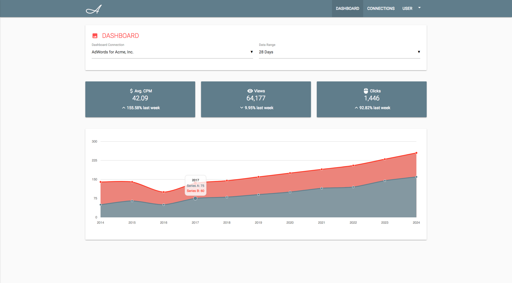
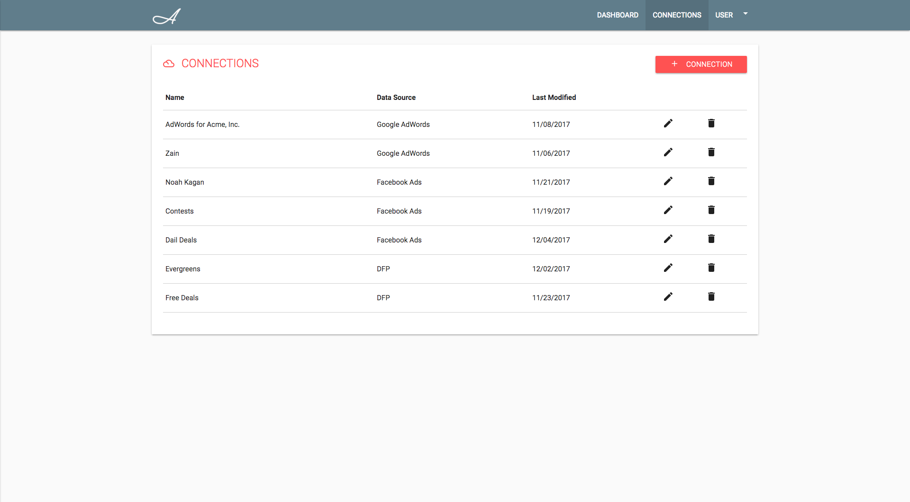
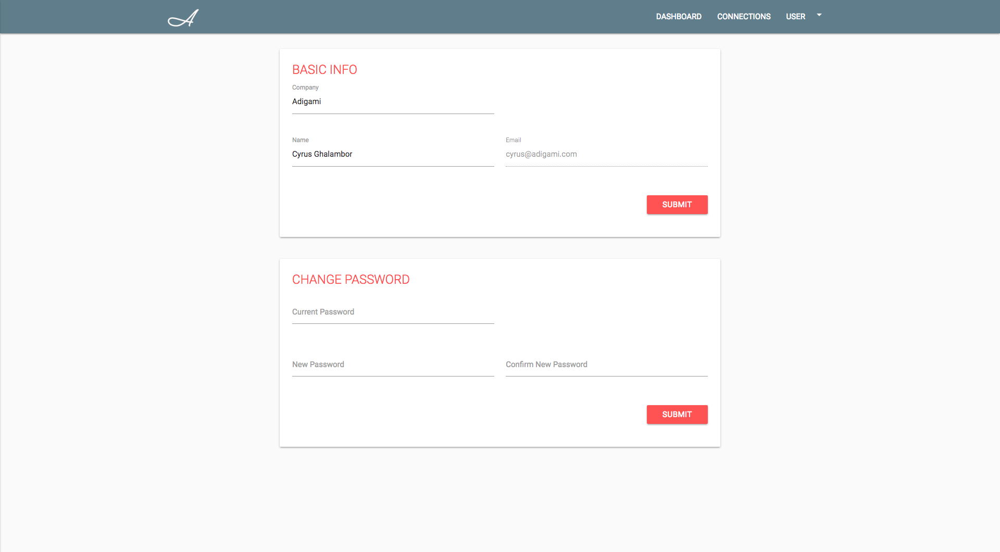

# 
# Materialize
<table>
<tr>
<td>
  A front-end interface of the <a href="http://www.adigami.com">Adigami</a> platform that users can interact with, create accounts on, and run visualizations of their data.
</td>
</tr>
</table>

## Demo

Here is a working live demo :  https://kelvinman.github.io/Materialize/Views/Pages/login.html

## Site

### Dashboard

### Connnections Page

### Settings Page

## [Usage](https://kelvinman.github.io/Materialize/Views/Pages/login.html)

### Bug / Feature Request

If you find a bug (the website couldn't handle the query and / or gave undesired results), kindly open an issue [here](https://github.com/kelvinman/Materialize/issues/new) by including your search query and the expected result.

If you'd like to request a new function, feel free to do so by opening an issue [here](https://github.com/kelvinman/Materialize/issues/new). Please include sample queries and their corresponding results.

## Built with

- [jQuery](https://www.w3schools.com/jquery/default.asp) - jQuery simplifies HTML document traversing, event handling, animating.
- [morris.js](http://morrisjs.github.io/morris.js/) - Simple API for drawing line, bar, area and donut charts.
- [Materialize](http://materializecss.com/) - Modern responsive CSS framework based on Material Design by Google.

## To-do

-

## Team

[Kelvin Man ](https://github.com/kelvinman) |[ Xiaoyu ](https://github.com/xwen5) |[ Xiaosong Weng ](https://github.com/Nyarukoooo)

## [License]()

UCI © [Kelvin Man ](https://github.com/kelvinman)
